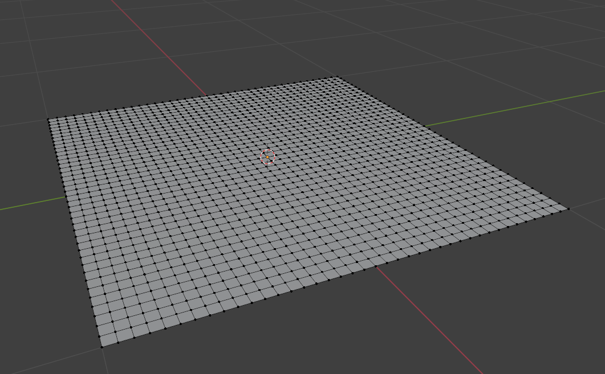
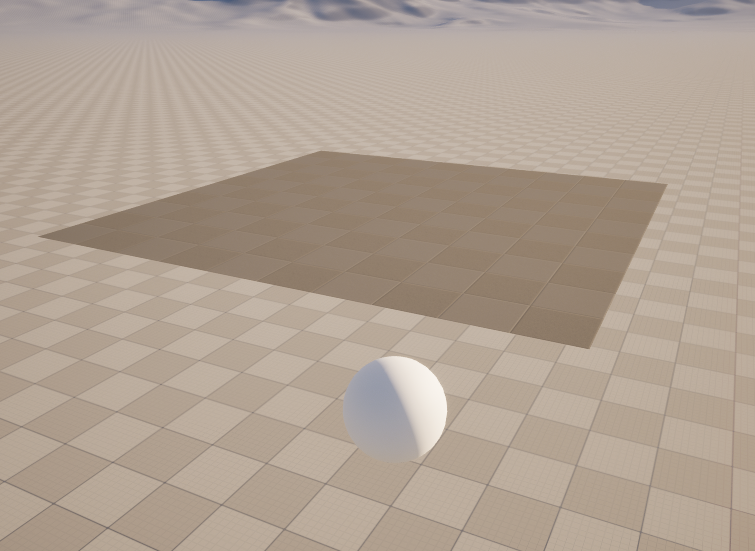
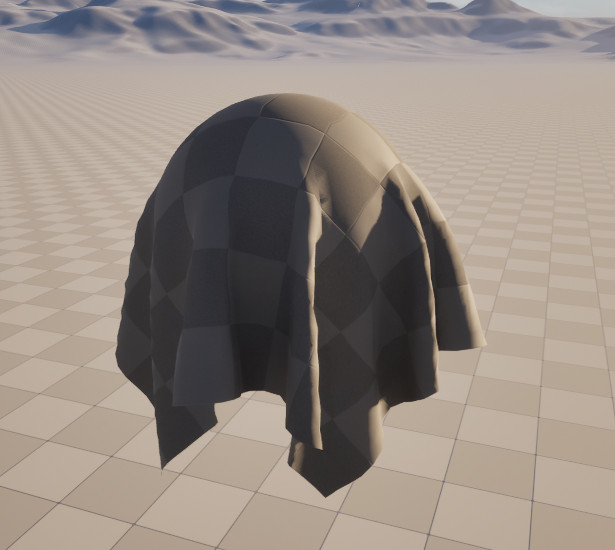
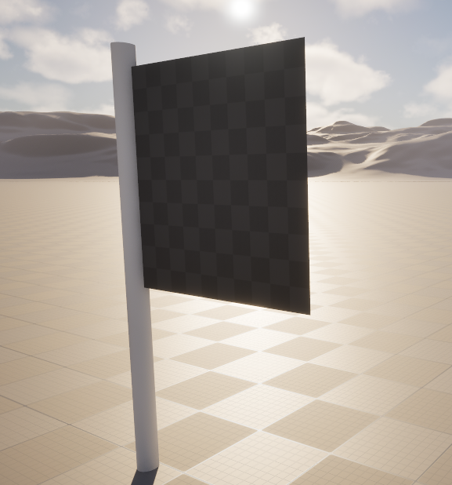
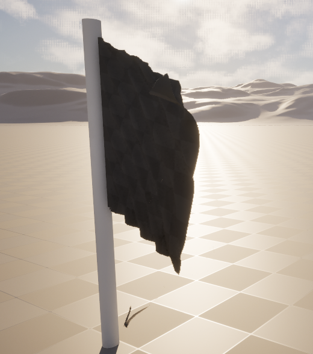

# FallingCloth_Plus_Flag - Unreal Engine Cloth & Flag Simulation

## Overview

This project demonstrates two cloth simulations in Unreal Engine, created by importing Blender-modeled plane with skeletal mesh and implementing UE (version 5.6) cloth plugin:

- **Image 1:** Plane Creation
- **Image 2a & 2b:** Falling Cloth on sphere - Before & After
- **Simulation 1:** Falling Cloth on sphere    
- **Image 3a & 3b:** Flag Simulation - Before & After
- **Simulation 2:** Flag Simulation

### Modeling and Workflow

- **Modeling:**  
  The plane was modeled in Blender (version 4.4), where vertices were created and positioned manually to define the cloth mesh.
  
- **Export & Import:**  
  The mesh was exported as FBX file from Blender. They were then imported into Unreal Engine (version 5.6) with skeletal mesh enabled.
  
- **Cloth Setup:**  
  Unreal Engine's cloth plugin was used to paint and define the soft cloth properties directly on the plane meshe inside UE, enabling realistic soft body movement for both falling cloth and flag simulations.

## Key Features

- Blender-to-Unreal pipeline for skeletal mesh cloth simulation  
- Two distinct simulations: Falling cloth and flag simulation  
- Use of UE cloth painting tools for soft body simulation  
- Flag simulation that responds to wind  

## Project Structure

- **Blender_Files/**: Original Blender files containing the modeled plane mesh and image file
- **Content/**: Unreal Engine project content including skeletal meshes, cloth assets, and materials  
- **Config/**: Project configuration files for Unreal Engine  
- **Media/**: Videos and images demonstrating the cloth and flag simulations  
- **FallingCloth_Plus_Flag.uproject**: Unreal Engine project file  

## How to Use

1. Open **FallingCloth_Plus_Flag.uproject** with Unreal Engine 
2. Navigate to the **Content** folder to explore the imported skeletal mesh and cloth assets
3. Either select **.umap** to see the falling cloth simulation or go to **Flag Testing** folder and select **.umap** to see flag simulation
4. Run the simulation or play the scene to see the falling cloth and flag respond to physics and wind  

## Requirements

- Blender 4 or newer
- Unreal Engine 5.3 or newer  
- Cloth plugin enabled in Unreal Engine  

## Screenshots / Video

  
   
  <em>Image 1: Plane Creation</em>

 

  
   
  <em>Image 2a: Cloth before falling on sphere</em>

 

  
   
  <em>Image 2b: Cloth after falling on sphere</em>

  <video src="https://private-user-images.githubusercontent.com/187529173/468909184-ff6f796c-a8f8-4568-9d94-e946b4360cfc.mp4" controls width="700"></video>
  
<em>Simulation 1: Falling Cloth on Sphere</em>

  
   
  <em>Image 3a: Flag (before)</em>

  
   
  <em>Image 3b: Flag (after)</em>

  <video src="https://private-user-images.githubusercontent.com/187529173/468919186-15b588a2-c1ad-4c4b-ae54-182b4202846e.mp4" controls width="700"></video>
  
<em>Simulation 2: Flag</em>

